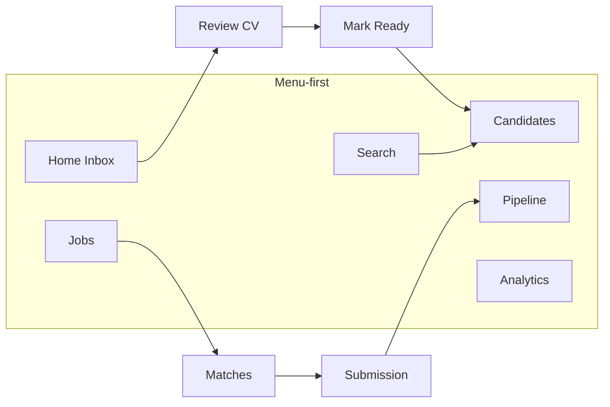

# Product Discovery — AI Recruiting Workspace

**Status:** DISCOVERY — decisions LOCKED (see [DECISIONS-LOCKED.md](./DECISIONS-LOCKED.md))  
**Date:** 2026-07-20  
**Implementation:** Forbidden until wireframes signed.

---

## 0. Vision (LOCKED)

> **The Assistant is the application. Everything else is a capability exposed through the Assistant.**

> **Recruiters should accomplish recruiting work by expressing intent, not navigating software.**

| | |
|--|--|
| Product | RecruiterSup = **AI Recruiting Workspace** |
| Primary surface | **Recruiter Assistant** |
| ATS | Retained as **capabilities** under Knowledge / Automation — not deleted |
| Rejected | ATS+AI · chatbot-in-ATS · copilot-beside-ATS · “chat on Home” |

**Modes (LOCKED):** Ask · Analyze · Act — see DECISIONS-LOCKED §D6.

**Hard rule:** No Assistant UI code until PNG wireframes approved.

---

## 1. Current recruiter workflow (as shipped)



**Observed loop today**

1. CV arrives → Import / Inbox  
2. Review knowledge fields → Ready  
3. Job exists → Match / submit  
4. Pipeline moves stages → interview / offer  
5. Analytics / Reports (API) for status  

**Friction of menu-first**

- Intent “tìm Senior Java HCM &lt;60M” forces Search → filters → open cards.  
- Intent “review CV này” requires Import then Home/Inbox.  
- Intent “so sánh 2 ứng viên” has no first-class path.  
- Copilot interview Q lives buried on Job detail.

Backend (through EPIC-014) is largely **tool-ready**. UX is still **ATS-shaped**.

---

## 2. User goals (intent inventory)

| # | Goal (what they try to finish) | Example utterance |
|---|--------------------------------|-------------------|
| G1 | Review a CV | “Review this CV” / vừa nhận CV |
| G2 | Find candidates | “Find Senior Java in HCM under 60M” |
| G3 | Match to a JD / job | “Who fits this Backend JD?” |
| G4 | Create a Job from JD | “Create Backend job from this JD” |
| G5 | Build a shortlist | “Shortlist top 5 for this role” |
| G6 | Interview prep | “Generate interview questions for Cuong vs this job” |
| G7 | Pipeline action | “Move Cuong to Interview for Backend” |
| G8 | Compare candidates | “Compare Cuong and An for Backend” |
| G9 | Status / analytics | “How many placements this week?” |
| G10 | Export / report | “Export pipeline CSV for client” |
| G11 | Upload only | “Upload these CVs” / “Upload JD” |

---

## 3. Goal → NL command feasibility

Legend: **NL** = natural-language primary · **Confirm** = human gate before write · **Artifact** = UI returned in Assistant.

### G1 — Review CV

| | |
|--|--|
| NL? | **Yes** |
| Tools | `ImportResume`, `OpenReview`, `KnowledgeReview`, `MarkReady` |
| Existing APIs | `POST /candidates/import-resume`, review + knowledge endpoints, mark-ready |
| Missing | Intent router; optional “attach file to message” UX |
| Confirm | Soft for edits; **hard** for Mark Ready / archive |
| Artifact | Split **Scorecard** (knowledge) + resume pane + suggested next actions |

### G2 — Find candidates

| | |
|--|--|
| NL? | **Yes** |
| Tools | `ParseSearchIntent`, `SearchCandidates`, `FilterByLocationSalary` |
| Existing APIs | `GET /search`, `GET /candidates`; salary/location may be partial in knowledge |
| Missing | Robust NL→filter mapping; semantic search (flag OFF); structured salary/geo if sparse |
| Confirm | None for read; confirm before bulk outreach |
| Artifact | **Candidate Cards** + facets + “Save search” / “Match to job” |

### G3 — Match JD / job

| | |
|--|--|
| NL? | **Yes** |
| Tools | `ResolveJob`, `RunMatching`, `RankCandidates` |
| Existing APIs | `GET /matching`, `GET /jobs/:id/matches` |
| Missing | Flag `ai.matching.enabled` currently **false** — product must turn on or gate |
| Confirm | Read-only list; confirm before create submissions |
| Artifact | Ranked match list + evidence chips |

### G4 — Create Job from JD

| | |
|--|--|
| NL? | **Yes** |
| Tools | `ExtractJd`, `PrefillJob`, `PreviewJob`, `CreateJob` |
| Existing APIs | `POST /jobs` (text/multipart), job review flow |
| Missing | Explicit “extract → preview → confirm” assistant choreography (API pieces exist) |
| Confirm | **Hard** before Create |
| Artifact | **Job Preview card** → Confirm → Job created toast + link |

### G5 — Build shortlist

| | |
|--|--|
| NL? | **Yes** |
| Tools | `CreateShortlist`, `AddToShortlist`, `ShareShortlist` |
| Existing APIs | Adjacent: matches + submissions / “Sourced” |
| Missing | **No shortlist entity/API/UI** — net-new capability |
| Confirm | Confirm list name + membership changes |
| Artifact | Shortlist board / ordered cards |

### G6 — Interview questions

| | |
|--|--|
| NL? | **Yes** |
| Tools | `CopilotSuggestInterviewQuestions` |
| Existing APIs | `POST /copilot/suggest-interview-questions` |
| Missing | First-class Assistant surface (today buried in Job detail) |
| Confirm | Draft-only (existing copilot rule); user copies/edits |
| Artifact | **Question list** + evidence |

### G7 — Pipeline actions

| | |
|--|--|
| NL? | **Yes** (with confirm) |
| Tools | `ResolveSubmission`, `TransitionStage`, `ScheduleInterview`, `CreateOffer` |
| Existing APIs | recruitment + automation stage-move |
| Missing | NL entity resolution (“Cuong” → candidate/submission) |
| Confirm | **Hard** for stage / offer / place |
| Artifact | Pipeline timeline + undo/audit link |

### G8 — Compare candidates

| | |
|--|--|
| NL? | **Yes** |
| Tools | `LoadProfiles`, `DiffSkills`, `CopilotSummarize` |
| Existing APIs | candidate detail, knowledge, copilot summarize; **no compare endpoint** |
| Missing | Compare tool + side-by-side artifact |
| Confirm | Read-only |
| Artifact | **Compare table** + suggested next (shortlist / reject) |

### G9 — Analytics

| | |
|--|--|
| NL? | **Yes** |
| Tools | `AnalyticsOverview`, `AnalyticsByJob` |
| Existing APIs | `GET /analytics/*` |
| Missing | NL time-range parsing |
| Confirm | None |
| Artifact | KPI strip / small charts |

### G10 — Reports

| | |
|--|--|
| NL? | **Yes** |
| Tools | `ReportOverview`, `ExportCsv` |
| Existing APIs | `GET /reports/overview`, `/export` |
| Missing | **Web screen**; Assistant export download |
| Confirm | Confirm export scope |
| Artifact | Report summary + download |

### G11 — Upload only

| | |
|--|--|
| NL? | Partial (attachment-first) |
| Tools | `ImportResume`, `ImportJd` |
| Existing APIs | import-resume, POST jobs multipart |
| Missing | Unified drop-zone in Assistant |
| Confirm | Soft |
| Artifact | Import result + “Review now?” |

---

## 4. Interaction Model

### 4.1 Core loop

```text
Intent (text | file | suggestion chip)
    → Intent Router (classify + extract slots)
    → Tool Plan (1..n tools, ordered)
    → Execute (read tools auto; write tools → Confirm)
    → Artifact (cards / scorecard / preview / table)
    → Suggested Actions (chips)
    → History (conversation + tool audit)
```

### 4.2 Worked examples

**A. Find Senior Java in HCM under 60M**

```text
User utterance
  → Intent: find_candidates
  → Slots: title≈Senior Java, location=HCM, salary_max=60M
  → Tools: SearchCandidates (+ optional Match if job context)
  → Artifact: Candidate Cards
  → Actions: Open · Shortlist · Match to job · Save search
```

**B. Review this CV**

```text
User + file
  → Intent: review_cv
  → Tools: ImportResume → OpenReview
  → Artifact: Scorecard + resume
  → Actions: Approve fields · Mark Ready · Find similar · Attach to job
```

**C. Create Backend Job from this JD**

```text
User + JD file/text
  → Intent: create_job
  → Tools: ExtractJd → PrefillJob → Preview
  → Confirm gate
  → CreateJob
  → Artifact: Job created + “Find matches”
```

### 4.3 Confirmation model (LOCKED)

| Class | Mode | Gate |
|-------|------|------|
| **Read** | Ask / Analyze | Execute immediately — no confirm |
| **Write** | Act | **Preview → Confirm → Execute** — never skip Preview |

Read examples: Review CV · Find · Search · Analytics · Compare · Summarize  

Write examples: Create Job · Update Candidate · Move Pipeline · Delete · Email · Automation  

### 4.4 Assistant modes (LOCKED)

| Mode | Intent shape | Output |
|------|--------------|--------|
| **Ask** | Question / lookup | Answer (+ optional cards) |
| **Analyze** | Review / score / reason | Scorecard · reasons · recommendation |
| **Act** | Create / update / move | Preview → Confirm → Execute |

### 4.5 Tool calling layer (later — not now)

Tools wrap existing module services. Mode selects confirm policy. Zero Prompt Rule for SoT writes: no silent mutation without Act Preview.

---

## 5. Navigation redesign (LOCKED)

ATS **not deleted**. Primary vs secondary:

```
Recruiter Assistant          ← primary
Knowledge                    ← expand
  ├── Candidates
  ├── Jobs
  ├── Pipeline
  ├── Analytics
  ├── Reports
  └── Audit
Automation
History
Settings
```

Candidate / Job / Pipeline / Search / Analytics / Reports are **capabilities** reachable from Assistant artifacts and from Knowledge — not the default mental model.

```text
┌─────────────────────────────────────────────┐
│ Assistant     Knowledge  Automation  History ⚙│
├─────────────────────────────────────────────┤
│  Recruiter Assistant                        │
│  What do you want to accomplish today?      │
│  ┌───────────────────────────────────────┐  │
│  │ Find Senior Java candidates under 60M │  │
│  └───────────────────────────────────────┘  │
│  📎 Upload CV   📎 Upload JD                │
│  Suggested · Recent · mode: Ask|Analyze|Act │
└─────────────────────────────────────────────┘
```

---

## 6. UX wireframes (text — pre-visual)

> PNG set to be drawn **after** Founder approval of §4–§5. No code until then.

| WF | Screen | Must show |
|----|--------|-----------|
| WF-01 | Assistant empty | Greeting, composer, Upload CV/JD, Suggested, Recent |
| WF-02 | Assistant + find results | Intent echo, Candidate Cards, Actions |
| WF-03 | Review-from-Assistant | Scorecard + resume + Mark Ready confirm |
| WF-04 | Create-job preview | Prefill fields, Confirm / Edit |
| WF-05 | Confirm hard action | Diff of mutation, Confirm / Cancel |
| WF-06 | Knowledge hub | Tabs: Candidates / Jobs / Pipeline (tools, not home) |
| WF-07 | History | Thread list + reopen artifact |
| WF-08 | Compare | Side-by-side + next actions |
| WF-09 | Shortlist | Ordered list (gap — mark as future) |
| WF-10 | Settings | Flags, integrations, actor |

---

## 7. Roadmap (LOCKED priority)

| Sprint | Focus |
|--------|--------|
| **0** | Discovery + decisions + PNG wireframes |
| **1** | CV Review → JD Parsing → Search → Matching · start **EPIC-015 Intelligent Ingestion** (after D10–D12 on main) |
| **2** | Interview / JD gen / Summary / Reports · **EPIC-016 Knowledge Workspace** |
| **3** | Pipeline · Automation · Email · **EPIC-017 Tool Orchestration** beginnings |
| **4** | Deep Research / Market · **EPIC-018 AI Automation** |

**Out of scope until Sprint 0 wireframes approved:** Assistant UI code, Memory Bank edits, renaming routes in app.

---

## 8. Inventory snapshot (evidence)

- Web today: Home inbox, Import, Candidates, Search, Jobs, Pipeline, Analytics; **no Reports screen**.  
- APIs strong through EPIC-014 (search, matching, copilot, reports, recruitment).  
- Flags OFF: truth engine, knowledge graph, semantic search, duplicate detection, **matching**.  
- Home today = “CV waiting + Start Review” — correct for ATS review, wrong as primary for AI Workspace.

---

## 9. Founder decisions — RESOLVED

| # | Decision | Resolution |
|---|----------|------------|
| 1 | Vision | AI Recruiting Workspace; Assistant = application |
| 2 | Nav | Assistant · Knowledge(+) · Automation · History · Settings |
| 3 | Confirm | Read immediate; Write = Preview → Confirm → Execute |
| 4 | Tools | Sprint 1–4 as §7 |
| 5 | Name | **Recruiter Assistant** |
| 6 | Modes | Ask · Analyze · Act |
| 7 | Language | D10 — Intent → slots (VI/EN/mixed/shorthand) |
| 8 | Quiet AI | D11 — outcomes first; details on demand |
| 9 | Intelligent Ingestion | D12 · [EPIC-015](../epics/EPIC-015-Intelligent-Ingestion.md) DRAFT · [Capability roadmap 015–018](./ASSISTANT-CAPABILITY-ROADMAP.md) |
| 10 | Artifact-first | D13 — short answer + primary artifact |
| 11 | Progressive disclosure | D14 — summary depth first; Details on demand |

**Remaining:** Merge UX core (D10–D14) → Spec-sign EPIC-015 → Impl → Validation → 016+.
