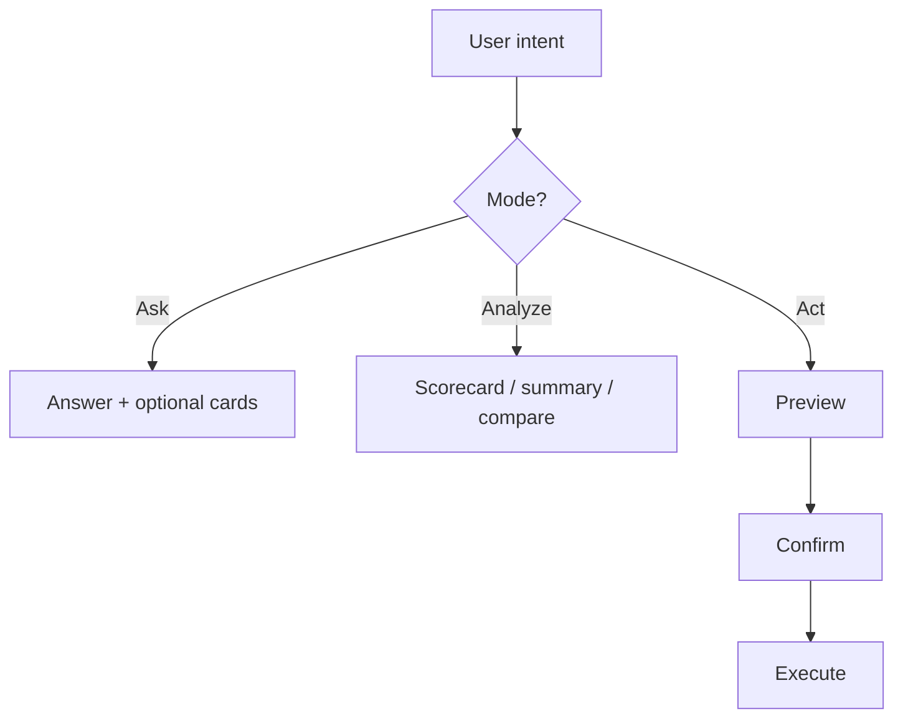

# Product Decisions — AI Recruiting Workspace

**Status:** LOCKED (Founder) — 2026-07-20  
**Scope:** Product only. No implementation in this document.  
**Companion:** [AI-WORKSPACE-DISCOVERY.md](./AI-WORKSPACE-DISCOVERY.md)

---

## North star

> **The Assistant is the application. Everything else is a capability exposed through the Assistant.**

Not: ATS + AI · chatbot-in-ATS · copilot beside ATS.

> **Recruiters should accomplish recruiting work by expressing intent, not navigating software.**

**Product name for primary surface:** Recruiter Assistant  
(Not Command Center · Inbox · Home)

---

## D1 — Vision

| Choose | Reject |
|--------|--------|
| RecruiterSup = **AI Recruiting Workspace** | ATS + AI features |
| AI is the **entry point** | AI chatbot inside ATS |
| ATS = capability set behind Assistant | Copilot panel beside classic ATS |

---

## D2 — Navigation

ATS **is not deleted**. It becomes secondary under Knowledge / Automation.

```
Recruiter Assistant          ← primary entry
Knowledge                    ← expand
  ├── Candidates
  ├── Jobs
  ├── Pipeline
  ├── Analytics
  ├── Reports
  └── Audit
Automation
History
Settings
```

| Layer | Role |
|-------|------|
| Assistant | Primary — intent, Ask / Analyze / Act |
| Knowledge | Secondary — browse durable objects |
| Automation | Secondary — rules / workflows |
| History | Threads + tool runs |
| Settings | Workspace, flags, integrations |

---

## D3 — Confirmation model

**One rule.**

### Read → execute immediately

Examples: Review CV · Find candidate · Analytics · Search · Compare · Summarize  

No confirm prompt.

### Write → never skip Preview

```
Intent → Preview → Confirm → Execute
```

Examples: Create Job · Update Candidate · Move Pipeline · Delete · Email · Automation  

Hard rule: **No write without Preview.**

---

## D4 — Tool priority (roadmap)

### Sprint 1 — 80% daily work

```
CV Review → JD Parsing → Candidate Search → Candidate Matching
```

### Sprint 2

```
Interview Questions → JD Generator → Candidate Summary → Reports
```

### Sprint 3

```
Pipeline → Automation → Email → Calendar → Scheduling
```

### Sprint 4

```
Deep Research → Market Salary → Boolean Builder → LinkedIn Intelligence → Company Intelligence
```

---

## D5 — Naming

| Use | Do not use |
|-----|------------|
| **Recruiter Assistant** | Command Center |
| | Inbox (as primary) |
| | Home |

---

## D6 — Assistant modes (differentiation)

Every interaction classifies into exactly one mode:

### 1. Ask

```
“Có ai biết React?”
  → Search / retrieve
  → Answer (+ optional Candidate Cards)
```

Read-class. Immediate.

### 2. Analyze

```
“Review CV”
  → AI analysis
  → Score · Reason · Recommendation
```

Read-class (artifacts). Immediate. Writes still go through Preview if user then Acts.

### 3. Act

```
“Tạo Job”
  → Preview
  → Confirm
  → Execute
```

Write-class. Preview mandatory.



---

## Discovery assumption correction

| Was | Now |
|-----|-----|
| AI is a feature of the ATS | **Assistant is the application** |
| Pages are primary; AI assists | Capabilities are exposed **through** the Assistant |
| “Add chat to Home” | Redesign operating model first |

---

## D7 — Visual language (LOCKED · Sprint 0 v2)

Quiet productivity UI (GitHub / Linear / Vercel / Notion AI) — **not** glowing AI dashboard.

- Inter · 8px grid · radius 8–12 · ~90% grayscale  
- Green `#238636` only for positive CTAs  
- No “Thinking…” — progressive tool steps  
- Transparency: tools · data · why · confidence  
- Law: [sprint-0/EIGHT-HOUR-TEST.md](./sprint-0/EIGHT-HOUR-TEST.md)  
- Full tokens: [sprint-0/DESIGN-SYSTEM.md](./sprint-0/DESIGN-SYSTEM.md)

---

## D8 — Keyboard-first (LOCKED)

See [sprint-0/SPRINT-0-SIGNED.md](./sprint-0/SPRINT-0-SIGNED.md). `/` focus · `⌘/Ctrl+K` command · `Esc` close · `↑` edit last · `Tab` suggestions · `Enter` send · `⇧Enter` newline.

## D9 — Deep-linkable (LOCKED)

`/assistant` · `/assistant/c/:id` · existing `/candidates/:id` · `/jobs/:id` · `/review/:id`.

---

## D10 — Language-agnostic interaction (LOCKED)

**Principle:** Intent → Structured Parameters → Tool — not “learn English prompts”.

- Understand Vietnamese, English, mixed, and shorthand.
- Users do **not** learn fixed syntax.
- Every utterance becomes `Intent + slots` before tools run.
- Same intent for:
  - `Tìm Java HCM dưới 60M`
  - `Find Java in HCM under 60M`
  - `java hcm 60m`
  - `Có ai Java lương khoảng 60 triệu không?`
  → `SEARCH_CANDIDATE` + shared filters.

Ask · Analyze · Act stay language-independent.

Implementation: `web/src/assistant/intent.ts` · tests: `tests/assistant/intent.test.ts`

---

## D11 — Quiet AI (LOCKED)

> The assistant should expose **outcomes**, not implementation details.

**Default UI (90% of time) shows only:**

1. Answer (colleague tone — not system logs)
2. Artifacts (when they help act)
3. Suggested next actions

**While running:** one status line only (`Searching candidates…` / `Analyzing CV…` / `Matching JD…`). No multi-step tool theatre.

**On demand:** `Show details` / ⓘ reveals tools, sources, intent, slots, timing, confidence, model.

**Do not surface by default:** tool chain checkmarks, Intent/Slots chips, Confidence scores, “Used / Why / Generated” blocks.

Recruiter feels Linear / GitHub / Notion AI — not an AI pipeline demo.

Design notes: [sprint-0/DESIGN-SYSTEM.md](./sprint-0/DESIGN-SYSTEM.md) · Quiet AI

---

## D12 — Intelligent Ingestion (LOCKED · capability)

> AI tiếp nhận tri thức tuyển dụng từ bất kỳ nguồn nào — không chỉ “bulk upload”.

**Triad:** D10 nói tự nhiên · D11 nghe tự nhiên · D12 thao tác / đưa dữ liệu tự nhiên.  
See [UX-PRINCIPLES-TRIAD.md](./UX-PRINCIPLES-TRIAD.md).

- **Pipeline (source-agnostic):** Source → Ingestion → Classification → Dedup → Extraction → Knowledge Objects → Assistant.
- **MVP sources:** ZIP · folder · multi-file. Later: Drive / Dropbox / email / CSV / ATS / webhook — same pipeline.
- Async **Ingestion Job** + Quiet progress % (D11); report = imported / duplicate / error / skipped.
- Mixed package: detect CV vs JD vs other → Confirm scope before Act.

**EPIC:** [EPIC-015 — Intelligent Ingestion](../epics/EPIC-015-Intelligent-Ingestion.md) (DRAFT SPEC — Founder sign before implement).  
**Roadmap:** [ASSISTANT-CAPABILITY-ROADMAP.md](./ASSISTANT-CAPABILITY-ROADMAP.md) (015→018).

---

## Sprint 0 status

**✅ SIGNED** as UX Foundation — [SPRINT-0-SIGNED.md](./sprint-0/SPRINT-0-SIGNED.md)

Interaction changes require a Product RFC. Visual polish OK.
