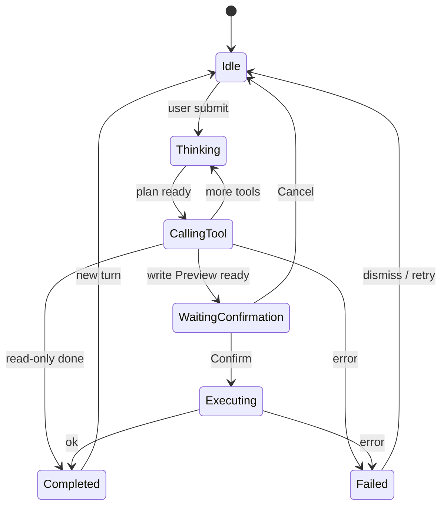

# Assistant States

**Status:** Sprint 0 · DESIGN ONLY

Every tool row / composer lock follows this state machine.



| State | UI | Composer |
|-------|-----|----------|
| **Idle** | Suggestions / empty hero | Enabled |
| **Working** | Progressive tool steps (never bare “Thinking…”) | Disabled |
| **Calling Tool** | Named step + checkmarks as substeps complete | Disabled |
| **Waiting Confirmation** | Act Preview + Confirm/Cancel | Disabled except Cancel |
| **Executing** | Progress on Confirm | Disabled |
| **Completed** | Artifact + suggestions + tool summary | Enabled |
| **Failed** | Error + what failed + Retry | Enabled |

### Progressive disclosure example (Ask · find)

```
Searching candidates...
✓ Reading database
✓ Applying filters (HCM, ≤60M)
✓ Ranking
✓ Preparing cards
```

### Transparency footer (every Completed Ask/Analyze)

```
Tools: SearchCandidates
Data: workspace candidates · filters …
Why: matched title≈Senior Java + location HCM
Confidence: — (or model score if Analyze)
```
