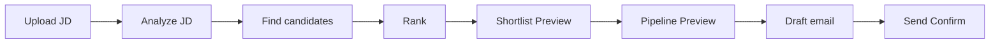

# Conversation Grammar — Recruiter Assistant

**Status:** LOCKED for Sprint 0 (Product)  
**Rule:** Every EPIC AI UX must map to this grammar. No one-off interaction patterns.

---

## North star

> The Assistant is the application. Capabilities are invoked through conversation.

**Modes:** Ask · Analyze · Act  
**Write rule:** Preview → Confirm → Execute (never skip)

---

## 0. Language layer (D10)

```
VI | EN | Mixed | Shorthand
        ↓
   Intent + Structured Parameters
        ↓
   Ask | Analyze | Act | Mixed
        ↓
   Tool → Artifact
```

Users never learn “prompts”. `java hcm 60m` ≡ `Tìm Senior Java ở HCM dưới 60 triệu`.

**Quiet AI (D11):** User sees short Answer + Artifacts + Next actions. Tool plan / intent / slots / confidence stay behind Show details.

**Artifact-first (D13):** The **artifact** is the response. Text only frames it (one–two sentences). Search → Cards; Review → Scorecard; Write → Preview.

**Progressive disclosure (D14):** Default artifact is *summary depth*. Open / Details / Show details reveal timeline, reasoning, job internals, ingest errors, etc.


---

## 1. Turn structure

```
[User turn]     text | file | suggestion chip | deep-link
     ↓
[Mode]          Ask | Analyze | Act | Mixed (sequence)
     ↓
[Tool plan]     0..n tools (visible states)
     ↓
[Artifact]      cards | scorecard | preview | chart | answer
     ↓
[Suggestions]   next intents (chips)
```

---

## 2. Mode: Ask

**Purpose:** Lookup / answer. Read-class. Immediate.

```
User:
  Find Senior Java in HCM under 60M

Assistant:
  [Thinking] → [Calling Tool: Search]
  → Answer (short narrative)
  → Candidate Cards
  → Suggestions: Compare · Match to job · Save search
```

**Grammar tokens**

| Token | Meaning |
|-------|---------|
| `Q` | User question / find intent |
| `A` | Short natural-language answer |
| `Cards` | Result set |
| `Cite` | Optional evidence / filters applied |

**Forbidden in Ask:** silent writes, emails, stage moves.

---

## 3. Mode: Analyze

**Purpose:** Score, reason, recommend. Read-class. Immediate.

```
User:
  Review this CV   (+ file)

Assistant:
  [Thinking] → [Calling Tool: Import + Analyze]
  → Scorecard
  → Strengths / Weaknesses / Missing skills
  → Recommendations
  → Suggestions: Mark Ready (→ Act) · Interview Q · Find similar
```

**Grammar tokens**

| Token | Meaning |
|-------|---------|
| `In` | Input (CV/JD/entity) |
| `Score` | Numeric / band scores |
| `Why` | Reasons / evidence |
| `Rec` | Recommendations (still read until Act) |

**Mark Ready / Create Job from Analyze** → escalate to **Act** with Preview.

---

## 4. Mode: Act

**Purpose:** Mutate SoT or external side effects. Write-class.

```
User:
  Create Backend Job from this JD

Assistant:
  [Calling Tool: ExtractJd]
  → Preview (Job draft card)
  → [Waiting Confirmation]
  → User: Confirm
  → [Executing]
  → Completed + link
```

**Grammar tokens**

| Token | Meaning |
|-------|---------|
| `Prev` | Preview of mutation |
| `Conf` | Explicit Confirm / Cancel |
| `Exec` | Execute after Confirm |
| `Done` | Success artifact |
| `Fail` | Error + retry |

**Invariant:** `Act` never jumps `Prev` → `Exec`.

---

## 5. Mode: Mixed (multi-step)

Long work = ordered modes. Each write step still Previews.

```
User: Upload JD
  → Analyze JD                    (Analyze)
  → Find candidates               (Ask)
  → Rank                          (Analyze)
  → Create shortlist              (Act: Prev→Conf→Exec)
  → Create pipeline entries       (Act)
  → Draft outreach email          (Analyze/draft OR Act if send)
  → [Waiting Confirmation] send   (Act)
```

**Diagram**



---

## 6. Conversation patterns (library)

| Pattern ID | Modes | Shape |
|------------|-------|--------|
| P-ASK-FIND | Ask | Q → A + Cards |
| P-ASK-KPI | Ask | Q → A + Chart |
| P-AN-CV | Analyze | In → Scorecard → Rec |
| P-AN-JD | Analyze | In → Requirements → Gaps |
| P-AN-CMP | Analyze | 2 entities → Compare table |
| P-ACT-CREATE | Act | Prev → Conf → Done |
| P-ACT-MOVE | Act | Prev (diff) → Conf → Done |
| P-MIX-HIRE | Mixed | Analyze → Ask → Act… |

New features must declare a **Pattern ID** in the EPIC spec.

---

## 7. Anti-patterns (forbidden)

- Chat that dumps raw JSON  
- Write without Preview  
- Different confirm UX per feature  
- Opening a full ATS page as the only response (deep-link OK *after* artifact)  
- Mode-less “AI magic” with no Ask/Analyze/Act label in design  
- Bare **“Thinking…”** with no tool steps  
- Answers with no tool / data / why disclosure  
- Glowing / neon / glass “AI” chrome  

---

## 8. Mode indicator (UI)

Every Assistant response header shows one of:

`Ask` · `Analyze` · `Act` · `Mixed`

Tool row shows progressive steps from [ASSISTANT-STATES.md](./ASSISTANT-STATES.md).  
Completed turns include transparency footer (tools · data · why · confidence).
