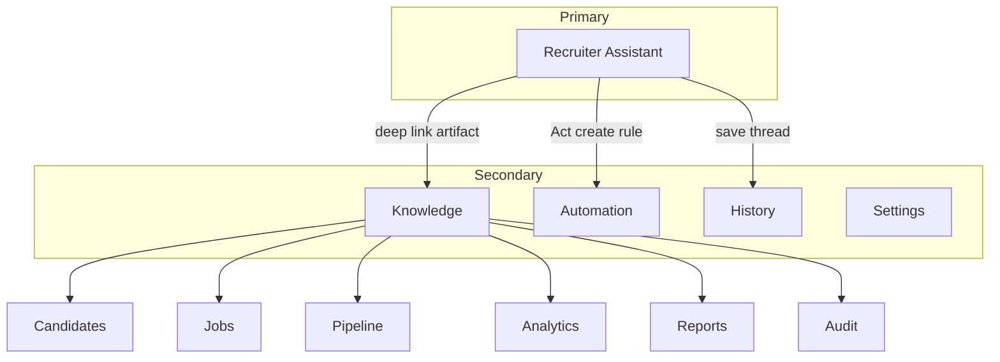

# Information Architecture & Navigation Map

**Status:** Sprint 0 · LOCKED structure (Product)

---

## 1. IA tree

```
RecruiterSup
├── Recruiter Assistant          [PRIMARY APPLICATION]
│   ├── Composer (text + files)
│   ├── Threads / Recent
│   ├── Artifacts (ephemeral in-thread)
│   └── Mode: Ask | Analyze | Act
├── Knowledge                    [SECONDARY — durable objects]
│   ├── Candidates
│   ├── Jobs
│   ├── Pipeline
│   ├── Analytics
│   ├── Reports
│   └── Audit
├── Automation                   [SECONDARY — rules / agents]
│   ├── Rules
│   ├── Runs
│   └── Templates
├── History                      [threads + tool audit]
└── Settings
    ├── Workspace
    ├── Feature flags (ops)
    ├── Integrations
    └── Actors / roles
```

---

## 2. Navigation map



**Default route after login:** Assistant (not Inbox).

**Legacy ATS pages** remain as Knowledge children / deep links — not top-level peers of Assistant.

---

## 3. Object model (for UX)

| Object | Owned by | Opened from |
|--------|----------|-------------|
| Conversation thread | Assistant / History | Recent, History |
| Candidate | Knowledge | Cards, Knowledge |
| Job | Knowledge | Preview Done, Knowledge |
| Submission / Pipeline | Knowledge | Act Done, Knowledge |
| Report export | Knowledge / Act | Journey 4 |
| Automation rule | Automation | Act “when X then Y” |

---

## 4. Capability → surface

| Capability | Primary surface | Fallback |
|------------|-----------------|----------|
| CV Review | Assistant Analyze | Knowledge → Candidate |
| JD Parse / Match | Assistant | Knowledge → Job |
| Search | Assistant Ask | Knowledge search (optional) |
| Pipeline move | Assistant Act | Knowledge → Pipeline |
| Analytics | Assistant Ask/Analyze | Knowledge → Analytics |
| Reports | Assistant Act export | Knowledge → Reports |
