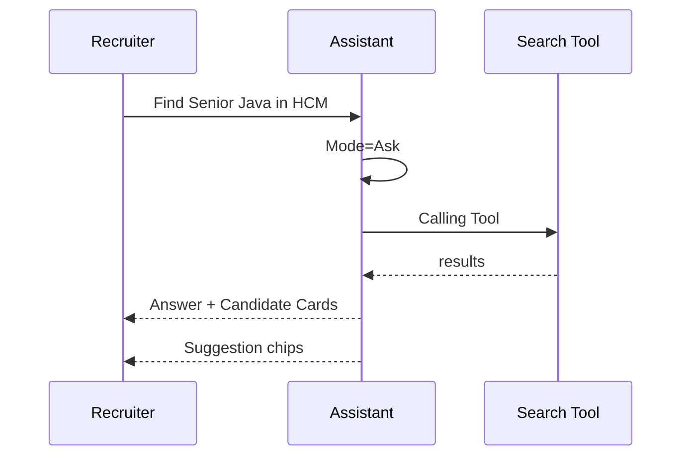
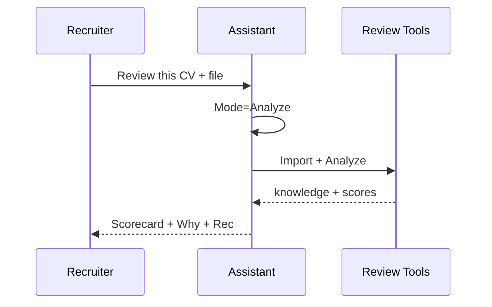
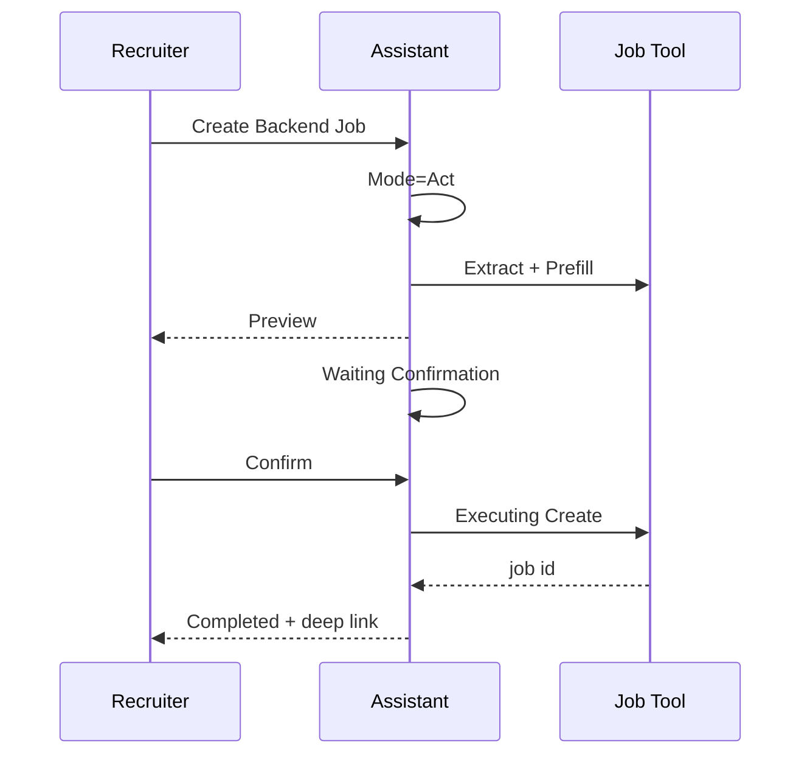
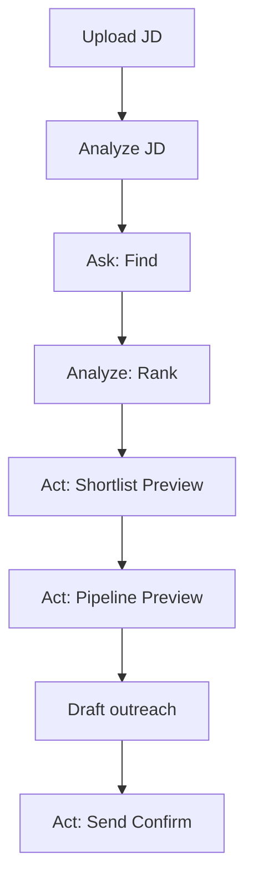

# Interaction Diagrams

**Status:** Sprint 0 · DESIGN ONLY

---

## Ask

```mermaid
sequenceDiagram
  participant U as Recruiter
  participant A as Assistant
  participant T as Search Tool
  U->>A: Find Senior Java in HCM
  A->>A: Mode=Ask
  A->>T: Calling Tool
  T-->>A: results
  A-->>U: Answer + Candidate Cards
  A-->>U: Suggestion chips
```

---

## Analyze

```mermaid
sequenceDiagram
  participant U as Recruiter
  participant A as Assistant
  participant T as Review Tools
  U->>A: Review this CV + file
  A->>A: Mode=Analyze
  A->>T: Import + Analyze
  T-->>A: knowledge + scores
  A-->>U: Scorecard + Why + Rec
```

---

## Act

```mermaid
sequenceDiagram
  participant U as Recruiter
  participant A as Assistant
  participant T as Job Tool
  U->>A: Create Backend Job
  A->>A: Mode=Act
  A->>T: Extract + Prefill
  A-->>U: Preview
  A->>A: Waiting Confirmation
  U->>A: Confirm
  A->>T: Executing Create
  T-->>A: job id
  A-->>U: Completed + deep link
```

---

## Mixed (JD → hire path)

```mermaid
flowchart TD
  U[Upload JD] --> An[Analyze JD]
  An --> Ask[Ask: Find]
  Ask --> Rank[Analyze: Rank]
  Rank --> SL[Act: Shortlist Preview]
  SL --> Pipe[Act: Pipeline Preview]
  Pipe --> Mail[Draft outreach]
  Mail --> Send[Act: Send Confirm]
```
