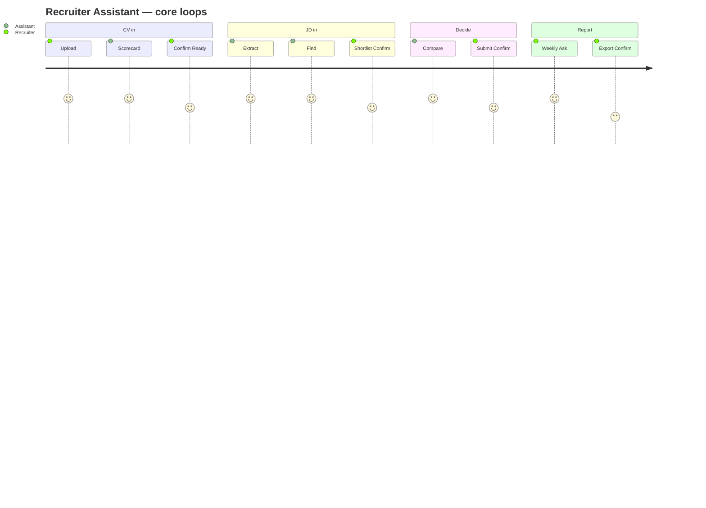

# User Journeys — Recruiter Assistant

**Status:** Sprint 0 · DESIGN ONLY

Each journey lists **mode**, **grammar pattern**, **artifacts**, **writes**.

---

## Journey 1 — Upload CV → Review → Improve → Save

```text
Upload CV
  → Analyze (P-AN-CV): Scorecard
  → User corrects fields (Act soft / Preview on batch save)
  → Improve suggestions (Analyze)
  → Save / Mark Ready (Act: Prev→Conf→Exec)
```

| Step | Mode | Artifact |
|------|------|----------|
| 1 Upload | — | File chip |
| 2 Review | Analyze | Scorecard + resume |
| 3 Improve | Analyze | Recommendations |
| 4 Save | Act | Preview ready state → Confirm |

**Success:** Candidate Ready in Knowledge; History thread saved.

---

## Journey 1b — Intelligent Ingestion dump → coffee → report (EPIC-015 · D12)

```text
Drop ZIP / folder / multi-file (later: Drive / email / …)
  → Mixed package? Confirm scope (CV only / JD / all)
  → Act: Ingestion Job (P-ACT-INGEST)
  → Quiet progress % (D11) — user can keep chatting
  → Report artifact: imported · duplicate · error · skipped
  → Next: Review now · Open candidates · Download report
```

| Step | Mode | Artifact |
|------|------|----------|
| 1 Drop / connect source | — | Source chip |
| 2 Scope (if mixed) | Act Preview | Package detect → Confirm |
| 3 Process | Act (async) | Quiet % status |
| 4 Done | Ask-facing | Ingestion report + next actions |

**Success:** Tri thức tuyển dụng vào Knowledge; recruiter không import từng file.

---

## Journey 2 — Paste JD → Extract → Find → Shortlist

```text
Paste / Upload JD
  → Analyze JD (P-AN-JD)
  → Ask: Find candidates (P-ASK-FIND)
  → Analyze: Rank / match
  → Act: Create shortlist (Prev→Conf)
```

| Step | Mode | Artifact |
|------|------|----------|
| 1 JD in | Analyze | Requirements extraction |
| 2 Find | Ask | Candidate Cards |
| 3 Rank | Analyze | Match list + coverage |
| 4 Shortlist | Act | Shortlist Preview |

**Gap note:** Shortlist SoT may land Sprint 3; until then Preview = “Sourced submissions” capability.

---

## Journey 3 — Search → Compare → Interview Q → Submit

```text
Search (Ask)
  → Select 2 (Ask)
  → Compare (Analyze P-AN-CMP)
  → Interview questions (Analyze / draft)
  → Submit to job (Act Prev→Conf)
```

| Step | Mode | Artifact |
|------|------|----------|
| 1 Search | Ask | Cards |
| 2 Compare | Analyze | Compare table |
| 3 Questions | Analyze | Question list (draft) |
| 4 Submit | Act | Submission Preview |

---

## Journey 4 — Weekly summary → Analytics → Report

```text
“Summarize this week” (Ask/Analyze)
  → Analytics narrative + charts (Ask/Analyze)
  → Export report (Act: scope Preview→Conf→download)
```

| Step | Mode | Artifact |
|------|------|----------|
| 1 Summary | Analyze | Narrative |
| 2 Charts | Ask | KPI + charts |
| 3 Report | Act | Export Preview |

---

## Journey map (overview)


